# GitHub Report Script - Architecture

## Request Flow Sequence Diagram

```mermaid
sequenceDiagram
    participant User
    participant Main as main.py
    participant Config as config.py
    participant Fetcher as GitHubFetcher
    participant Cache as CacheManager
    participant GitHub as GitHub GraphQL API
    participant Processor as DataProcessor
    participant Charts as ChartGenerator
    
    %% Configuration Phase
    User->>Main: python src/main.py
    Main->>Config: Load configuration
    Config-->>Main: MODE, DATE_RANGE, USER_IDS, etc.
    Main->>Main: Validate config
    Main->>Main: Display config summary
    
    %% Mode Decision
    alt MODE == FETCH or FETCH_AND_CHART
        Note over Main,GitHub: === FETCH PHASE ===
        
        Main->>Config: get_date_range()
        Config-->>Main: start_date, end_date
        
        Main->>Fetcher: new GitHubFetcher(thread_count=4)
        activate Fetcher
        
        Main->>Fetcher: fetch_commits(start_date, end_date, USER_IDS)
        
        %% Check Cache
        loop For each date in range
            Fetcher->>Cache: cache_exists(date_str)?
            activate Cache
            
            alt Cache exists and not force_refresh
                Cache-->>Fetcher: cached_data
                Note over Fetcher,Cache: Skip fetching, use cache
            else Cache missing or force_refresh
                Cache-->>Fetcher: None
                
                %% Rate Limit Check
                Fetcher->>Fetcher: _check_rate_limit_and_wait()
                Fetcher->>GitHub: GET /rate_limit
                GitHub-->>Fetcher: {remaining, reset, limit}
                
                alt remaining < 500
                    Fetcher->>Fetcher: Wait until reset + 5s
                end
                
                %% Fetch Repositories
                Fetcher->>GitHub: GraphQL: List org repositories (50/page)
                GitHub-->>Fetcher: {repositories{nodes, pageInfo}}
                
                loop For each repository
                    %% Fetch Branches with Pagination
                    Fetcher->>GitHub: GraphQL: List branches (50/page)
                    GitHub-->>Fetcher: {refs{nodes, pageInfo}}
                    
                    loop For each branch (paginated)
                        %% Fetch Commits
                        Fetcher->>GitHub: GraphQL: Get commit history<br/>(since, until, author filter)
                        GitHub-->>Fetcher: {target{history{nodes}}}
                        
                        loop For each commit
                            Fetcher->>Fetcher: Filter bots
                            Fetcher->>Fetcher: Deduplicate by SHA
                            Fetcher->>Fetcher: Track branch associations
                            Fetcher->>Fetcher: Extract stats (additions, deletions)
                        end
                    end
                end
                
                %% Handle Rate Limit Errors
                alt Rate limit error (429/403)
                    GitHub-->>Fetcher: Error: Rate limited
                    Fetcher->>Fetcher: Exponential backoff (5s, 10s, 20s...)
                    Fetcher->>GitHub: Retry request (max 10 retries)
                end
                
                %% Cache Results
                Fetcher->>Cache: write_cache(date_str, commits_data)
                Cache->>Cache: Check if content changed
                
                alt Content changed
                    Cache->>Cache: Update cached_at timestamp
                end
                
                Cache->>Cache: Write JSON to cache/commits/{date}.json
                Cache-->>Fetcher: Success
            end
            
            deactivate Cache
        end
        
        Fetcher-->>Main: Results dict {date: commits[]}
        deactivate Fetcher
        
        %% Processing Phase
        Note over Main,Processor: === PROCESSING PHASE ===
        
        Main->>Processor: new DataProcessor()
        activate Processor
        
        Main->>Processor: process_date_range(start_date, end_date, USER_IDS)
        
        loop For each date
            Processor->>Cache: read_cache(date_str)
            activate Cache
            Cache->>Cache: Read cache/commits/{date}.json
            Cache-->>Processor: {commits[]}
            deactivate Cache
            
            %% Deduplication Logic
            Processor->>Processor: Filter merge commits<br/>(message starts with "Merge")
            Note over Processor: Filtered out merge commits
            
            Processor->>Processor: Pass 1: SHA deduplication
            Note over Processor: Remove exact SHA duplicates
            
            Processor->>Processor: Pass 2: Squash-merge detection<br/>(same author, date, similar stats)
            Note over Processor: Keep highest priority branch<br/>(main > master > develop)
            
            %% Aggregation
            loop For each commit
                Processor->>Processor: Aggregate by user
                Processor->>Processor: Track repo breakdown
                Processor->>Processor: Track branch breakdown
                Processor->>Processor: Sum LOC stats (additions, deletions)
            end
            
            %% Write Output
            Processor->>Processor: Write output/{username}/{date}.json
            Note over Processor: {additions, deletions, total_loc,<br/>commit_count, branch_breakdown}
        end
        
        Processor-->>Main: Processing complete
        deactivate Processor
        
        Main->>Main: Display summary statistics
    end
    
    %% Chart Generation
    alt MODE == CHART or FETCH_AND_CHART
        Note over Main,Charts: === CHART PHASE ===
        
        Main->>Charts: new ChartGenerator()
        activate Charts
        
        Main->>Charts: generate_charts(start_date, end_date, USER_IDS)
        
        loop For each user
            Charts->>Charts: Read output/{username}/*.json
            Charts->>Charts: Aggregate daily stats
            Charts->>Charts: Detect branches across all dates
        end
        
        %% Generate Visualizations
        Charts->>Charts: Create Plotly interactive chart
        Note over Charts: Stacked area chart<br/>Color by branch<br/>Interactive tooltips
        
        Charts->>Charts: Write reports/{date}/report.html
        
        Charts->>Charts: Create static Matplotlib charts
        Note over Charts: PNG and PDF formats<br/>Repository breakdown
        
        Charts->>Charts: Write reports/{date}/report.png
        Charts->>Charts: Write reports/{date}/report.pdf
        
        Charts-->>Main: Charts saved to reports/
        deactivate Charts
        
        Main->>Main: Display chart file paths
    end
    
    Main-->>User: ✓ Complete!

```



## Data Flow Summary

### 1. **Configuration & Initialization** (`main.py` + `config.py`)
- Loads execution mode (FETCH/CHART/FETCH_AND_CHART)
- Determines date range (LAST_N_DAYS/CUSTOM_RANGE)
- Configures thread count, user IDs, organization

### 2. **GitHub Data Fetching** (`github_fetcher.py`)

**GraphQL Queries:**
1. **Repository Query** (paginated, 50/page):
   ```graphql
   organization(login: "dolr-ai") {
     repositories(first: 50, after: $cursor) {
       nodes { nameWithOwner }
       pageInfo { hasNextPage, endCursor }
     }
   }
   ```

2. **Branch Query** (paginated, 50/page per repository):
   ```graphql
   repository(owner: $owner, name: $repo) {
     refs(refPrefix: "refs/heads/", first: 50, after: $cursor) {
       nodes { name, target { ... } }
       pageInfo { hasNextPage, endCursor }
     }
   }
   ```

3. **Commit Query** (filtered by date and author):
   ```graphql
   target {
     ... on Commit {
       history(first: 100, since: $since, until: $until, author: { id: $userId }) {
         nodes {
           oid, message, committedDate
           author { user { login } }
           additions, deletions
         }
       }
     }
   }
   ```

**Rate Limiting Strategy:**
- Pre-check: Waits if remaining < 500 calls
- Exponential backoff: 5s → 10s → 20s → 40s → 80s (max 10 retries)
- Per-request retry on 429/403 errors
- Thread-safe rate limit checks

### 3. **Caching Layer** (`cache_manager.py`)
- **Storage**: `cache/commits/{YYYY-MM-DD}.json`
- **Thread-safe**: Locks during write operations
- **Smart updates**: Only updates `cached_at` if content changes
- **Structure**:
  ```json
  {
    "date": "2026-01-30",
    "cached_at": "2026-02-05T08:45:13Z",
    "commits": [
      {
        "sha": "abc123...",
        "author": "username",
        "repository": "dolr-ai/repo-name",
        "timestamp": "2026-01-30T10:30:00Z",
        "message": "commit message",
        "stats": { "additions": 100, "deletions": 50, "total": 150 },
        "branches": ["main", "develop", "feature/xyz"]
      }
    ],
    "commit_count": 42
  }
  ```

### 4. **Data Processing** (`data_processor.py`)

**Three-Stage Deduplication:**

1. **Merge Commit Filtering**:
   - Detects: Message starts with "Merge pull request" or "Merge branch"
   - Reason: Merge commits aggregate work already counted in constituent commits
   - Impact: ~117 merge commits filtered across 30 days

2. **SHA Deduplication**:
   - Removes exact duplicate SHAs
   - Handles commits appearing on multiple branches with same SHA

3. **Squash-Merge Detection**:
   - Groups commits by author + date
   - Compares stats: if difference < 1% or < 100 LOC
   - Keeps commit on highest priority branch:
     - Priority: `main` > `master` > `develop` > `staging` > `production` > others
   - Impact: ~50% reduction in duplicate counts (e.g., 410k → 206k LOC)

**Output Files**: `output/{username}/{YYYY-MM-DD}.json`
```json
{
  "date": "2026-01-30",
  "username": "john-doe",
  "additions": 1234,
  "deletions": 567,
  "total_loc": 1801,
  "commit_count": 5,
  "repositories": ["repo1", "repo2"],
  "repo_count": 2,
  "branch_breakdown": {
    "dolr-ai/repo1": {
      "main": { "additions": 800, "deletions": 200, "total_loc": 1000, "commit_count": 3 },
      "develop": { "additions": 434, "deletions": 367, "total_loc": 801, "commit_count": 2 }
    }
  },
  "processed_at": "2026-02-05T09:18:56Z"
}
```

### 5. **Visualization** (`chart_generator.py`)

**Outputs**:
1. **Interactive HTML** (Plotly):
   - Stacked area chart showing LOC over time
   - Color-coded by branch
   - Hover tooltips with details
   - Responsive and zoomable

2. **Static PNG/PDF** (Matplotlib):
   - Overall LOC trends
   - Per-repository breakdown
   - Suitable for reports/presentations

**Location**: `reports/{YYYYMMDD}/report_{start}_{end}.{html|png|pdf}`

## Threading & Concurrency

- **Default**: 4 concurrent threads (configurable)
- **Thread Pool**: Fetches multiple dates in parallel
- **Locks**: 
  - Rate limit checks (thread-safe)
  - Cache writes (thread-safe)
- **Progress**: tqdm progress bars for user feedback

## Error Handling

1. **Rate Limiting**: Exponential backoff with max retries
2. **Network Errors**: Graceful degradation, skip problematic dates
3. **Invalid Data**: Validation and filtering of malformed commits
4. **Cache Corruption**: Falls back to re-fetching if cache read fails

## Performance Optimizations

1. **Pagination**: 50 items/page (repositories, branches)
2. **Branch Tracking**: Single GraphQL query includes branches
3. **Bot Filtering**: Early filtering before processing
4. **Cache First**: Always check cache before API calls
5. **Bulk Processing**: Date-level parallelization
6. **Deduplication**: Multi-stage to minimize redundant counting

## Execution Modes

- **FETCH**: Fetch → Cache → Process
- **CHART**: Read processed data → Generate charts
- **FETCH_AND_CHART**: Full pipeline (fetch → process → chart)
- **REFRESH**: Force re-fetch and re-process (ignores cache)
